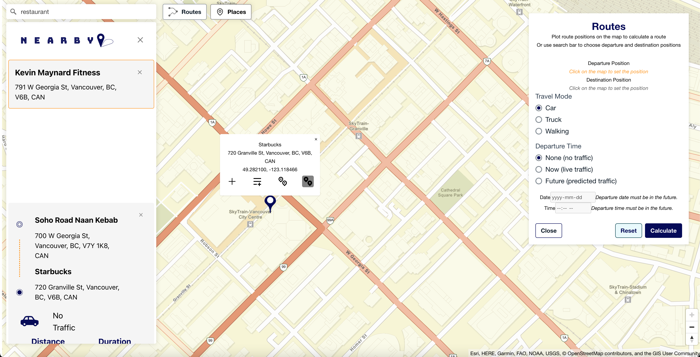

# NearbyApp
A route/trip planner CRUD app frontend. Users can explore a map of an area, save locations of interest, save a group nearby locations to saved locations, plot a route on the map between two locations and save it, and save a group of nearby routes that are close to a specific saved location

The Problem:  
Imagine you've lived downtown in a city for years, and everything important to you is close by — the gym, grocery store, office, kids' school, etc.
Then you get a fantastic job offer… in a new city you don’t know well.
How do you quickly find a neighborhood that’s just as convenient?  
Or...  
You're planning a trip to a new city.
You want to visit all the best historical sites and restaurants — ideally close to each other.
How do you plan this efficiently without jumping between multiple tabs?

The Solution:  
To solve this, I built The Nearby App — a route and trip planner designed to:

🔍 Find and log places of interest  
🗺️ Group locations by proximity  
📍 Calculate and save routes  
🗂️ Organize plans around a central location  

Yes, technically you could do this with Google Maps — but having tried that myself during a move, I found the experience clunky and not built for this specific use case.

Tech Stack:

TypeScript

React

AWS Location Service

SASS

AWS Amplify (for hosting)

Mapbox GLJs

Note: The code just a recent snapshot of the development environment. Production code in private repo on AWS codecommit

[Live Demo](https://development.d1kzsfeau1uesc.amplifyapp.com/)

# How To Use

This is a route planner. It can be used for various applications, but the core idea is that it is for when you need to keep a record of all the significant places near you and how far they are so you can easily plan trips to multiple places at once before starting a trip. For example, if you want to move to a new home but you want to keep a record of all the close by amenities, like grocery stores, gyms, malls, or restaurants, before going for a viewing. With this web app, you can search for all the places close to a given location and record them. This information can be used to quickly narrow down your list of prospective homes so you don't have to waste time going for viewings at homes that don't have the desired amenities. A more simple example could be for moving companies to plan or companies that deliver goods to multiple locations to plan trips beforehand. You can also check the general distance between places.

You can save a list of routes or a list of places. You can then select a place from the list and add nearby places to it. You can also add multiple nearby routes to each place.

---

## Find General Route

The most simple feature is being able to check the route of two points on the map. You can do this when you click on the route button. When the route panel is open, you can click two points of the map to find their distance information.

## Adding Places And Nearby Places

1. Search for a location with the search bar.
   

2. Or use the navigation button to jump to your location. Make sure to enable geolocation on your device for this to work.
   

3. Click the icon to add location to the places tab.
   

4. The places tab opens when a place is added. Click the places button to open and close the panel.
   

5. Search for other nearby locations.
   

6. Click on the added location to select it, then click the icon to add a nearby location to the selected location.
   
   

## Adding Routes And Nearby Routes

1. Click the highlighted icon to select the departure position.
   

2. Click the highlighted icon to select the destination position.
   

3. After selecting the destination position, the route panel opens. Select options and click the button to calculate the route.
   

4. After clicking calculate, a route summary pops up.
   

5. Click the highlighted button to add the route to the selected location.
   
   
   

6. Click the highlighted button to add the route to another list of routes only.
   
   
   

7. Click the reset button to start a new route calculation.
   
   
   

8. A list with multiple items could look like this.
   
   
